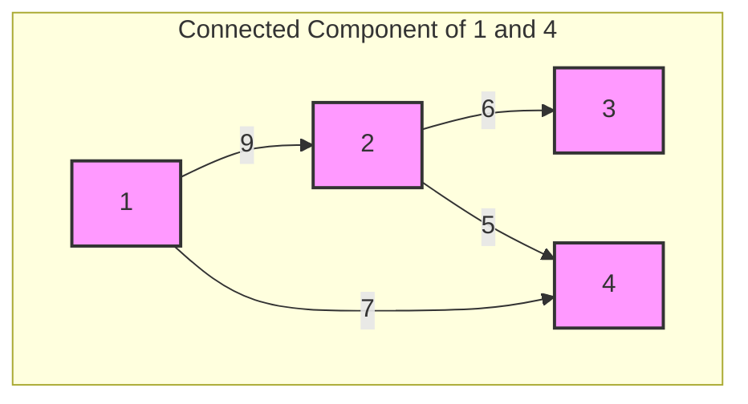

# [2492] Minimum Score of a Path Between Two Cities

**Difficulty:** Medium &nbsp;·&nbsp; **Daily Challenge:** 2026-07-04 &nbsp;·&nbsp; [Open on LeetCode](https://leetcode.com/problems/minimum-score-of-a-path-between-two-cities/)

**Topics:** Depth-First Search, Breadth-First Search, Union-Find, Graph Theory

> 🧠 Auto-generated study note. Read it, understand it, then **paste the solution yourself** on LeetCode. Nothing here is auto-submitted.

---

## Original Problem

You are given a positive integer n representing n cities numbered from 1 to n. You are also given a 2D array roads where roads[i] = [a_i, b_i, distance_i] indicates that there is a bidirectional road between cities a_i and b_i with a distance equal to distance_i. The cities graph is not necessarily connected.

The score of a path between two cities is defined as the minimum distance of a road in this path.

Return the minimum possible score of a path between cities 1 and n.

Note:

- A path is a sequence of roads between two cities.

- It is allowed for a path to contain the same road multiple times, and you can visit cities 1 and n multiple times along the path.

- The test cases are generated such that there is at least one path between 1 and n.

Example 1:

Input: n = 4, roads = [[1,2,9],[2,3,6],[2,4,5],[1,4,7]]
Output: 5
Explanation: The path from city 1 to 4 with the minimum score is: 1 -> 2 -> 4. The score of this path is min(9,5) = 5.
It can be shown that no other path has less score.

Example 2:

Input: n = 4, roads = [[1,2,2],[1,3,4],[3,4,7]]
Output: 2
Explanation: The path from city 1 to 4 with the minimum score is: 1 -> 2 -> 1 -> 3 -> 4. The score of this path is min(2,2,4,7) = 2.

Constraints:

- 2 <= n <= 10^5

- 1 <= roads.length <= 10^5

- roads[i].length == 3

- 1 <= a_i, b_i <= n

- a_i != b_i

- 1 <= distance_i <= 10^4

- There are no repeated edges.

- There is at least one path between 1 and n.

**Examples / sample tests:**

```
4
[[1,2,9],[2,3,6],[2,4,5],[1,4,7]]
4
[[1,2,2],[1,3,4],[3,4,7]]
```

---

## Problem Summary
The goal is to find the smallest road distance among all roads that are part of *any* possible path connecting city 1 to city n. We need to return this minimum distance.

## Intuition
The problem asks for the "minimum possible score of a path". A path's score is the minimum distance of any road *in that specific path*. This is a bit tricky. However, the crucial observation is that if a road `(u, v)` with distance `d` is part of *any* path from city 1 to city n, then `d` is a candidate for our answer.

Consider any path from city 1 to city n. All cities and roads in this path must belong to the **same connected component** as city 1 (and city n). Conversely, if a road `(u, v)` with distance `d` connects two cities `u` and `v` that are both part of the connected component containing city 1 (and city n), then we can always construct a path from 1 to `u`, use the road `(u, v)`, and then continue from `v` to `n`. This means `d` would be one of the distances in such a path.

Therefore, the problem simplifies significantly:
1.  Identify all cities that are reachable from city 1. Since the problem guarantees a path exists between 1 and n, city n will also be among these reachable cities. These cities form the **connected component** containing city 1.
2.  Once we have identified all cities in this component, we simply need to look at **all roads** in the original input `roads` array. If *both endpoints* of a road `(u, v)` are within this connected component, then that road's distance `d` is a potential candidate for our minimum score.
3.  The final answer will be the **minimum distance among all such candidate roads**.

## Approach
We can solve this using a Breadth-First Search (BFS) or Depth-First Search (DFS) to find the connected component.

1.  **Build Adjacency List**: First, convert the `roads` array into an **adjacency list** representation of the graph. For each road `[u, v, distance]`, add `v` to `u`'s list and `u` to `v`'s list, as roads are bidirectional. For this step, we only care about connectivity, so we don't need to store the distance in the adjacency list itself.
2.  **Find Reachable Cities (BFS/DFS)**:
    *   Initialize a `visited` set to keep track of all cities discovered in the connected component.
    *   Start a BFS (or DFS) from city 1.
    *   Add city 1 to a queue (for BFS) and mark it as visited.
    *   While the queue is not empty:
        *   Dequeue (or pop) a `current_city`.
        *   For each `neighbor` of `current_city` in the adjacency list:
            *   If `neighbor` has not been visited:
                *   Mark `neighbor` as visited.
                *   Enqueue (or push) `neighbor`.
    *   After the BFS/DFS completes, the `visited` set will contain all cities in the connected component of city 1.
3.  **Find Minimum Score**:
    *   Initialize a variable `min_score` to a very large value (e.g., `float('inf')`).
    *   Iterate through *all* roads `[u, v, distance]` in the original `roads` input array.
    *   For each road, check if *both* `u` and `v` are present in the `visited` set.
    *   If they are, it means this road connects two cities within the component of city 1. Update `min_score = min(min_score, distance)`.
4.  **Return `min_score`**: This will be the minimum possible score.

## Visualization

Let's use Example 1: `n = 4, roads = [[1,2,9],[2,3,6],[2,4,5],[1,4,7]]`.
We want to find the minimum score between city 1 and city 4.



1.  **Build Adjacency List**:
    *   1: \[2, 4]
    *   2: \[1, 3, 4]
    *   3: \[2]
    *   4: \[2, 1]

2.  **BFS from City 1**:
    *   Start with `q = [1]`, `visited = {1}`.
    *   Pop 1. Neighbors: 2, 4. Add them to queue and visited.
        *   `q = [2, 4]`, `visited = {1, 2, 4}`.
    *   Pop 2. Neighbors: 1, 3, 4.
        *   1 is visited.
        *   3 is not visited. Add 3. `q = [4, 3]`, `visited = {1, 2, 4, 3}`.
        *   4 is visited.
    *   Pop 4. Neighbors: 2, 1. Both visited.
    *   Pop 3. Neighbors: 2. Visited.
    *   Queue is empty.
    *   **Resulting `visited` set: `{1, 2, 3, 4}`**. All cities are in the component.

3.  **Find Minimum Score**:
    *   `min_score = infinity`
    *   Road `[1,2,9]`: 1 in `visited`, 2 in `visited`. `min_score = min(inf, 9) = 9`.
    *   Road `[2,3,6]`: 2 in `visited`, 3 in `visited`. `min_score = min(9, 6) = 6`.
    *   Road `[2,4,5]`: 2 in `visited`, 4 in `visited`. `min_score = min(6, 5) = 5`.
    *   Road `[1,4,7]`: 1 in `visited`, 4 in `visited`. `min_score = min(5, 7) = 5`.

## Dry Run

Let's trace Example 1: `n = 4, roads = [[1,2,9],[2,3,6],[2,4,5],[1,4,7]]`

**Step 1: Build Adjacency List**

| City | Neighbors |
| :--- | :-------- |
| 1    | \[2, 4]   |
| 2    | \[1, 3, 4] |
| 3    | \[2]      |
| 4    | \[2, 1]   |

**Step 2: BFS from City 1**

| Action              | `q` (Queue)      | `visited` Set | `current_city` | Neighbors of `current_city` |
| :------------------ | :--------------- | :------------ | :------------- | :-------------------------- |
| Initialize          | `[1]`            | `{1}`         | -              | -                           |
| Pop 1               | `[]`             | `{1}`         | 1              | \[2, 4]                     |
| Add 2 (not visited) | `[2]`            | `{1, 2}`      | -              | -                           |
| Add 4 (not visited) | `[2, 4]`         | `{1, 2, 4}`   | -              | -                           |
| Pop 2               | `[4]`            | `{1, 2, 4}`   | 2              | \[1, 3, 4]                  |
| 1 is visited        | `[4]`            | `{1, 2, 4}`   | -              | -                           |
| Add 3 (not visited) | `[4, 3]`         | `{1, 2, 4, 3}`| -              | -                           |
| 4 is visited        | `[4, 3]`         | `{1, 2, 4, 3}`| -              | -                           |
| Pop 4               | `[3]`            | `{1, 2, 4, 3}`| 4              | \[2, 1]                     |
| 2 is visited        | `[3]`            | `{1, 2, 4, 3}`| -              | -                           |
| 1 is visited        | `[3]`            | `{1, 2, 4, 3}`| -              | -                           |
| Pop 3               | `[]`             | `{1, 2, 4, 3}`| 3              | \[2]                        |
| 2 is visited        | `[]`             | `{1, 2, 4, 3}`| -              | -                           |
| Queue empty         | `[]`             | `{1, 2, 3, 4}`| -              | -                           |

**Final `visited` set: `{1, 2, 3, 4}`**

**Step 3: Find Minimum Score**

| Road `[u, v, distance]` | `u` in `visited`? | `v` in `visited`? | Condition `u in visited and v in visited` | `min_score` update |
| :---------------------- | :---------------- | :---------------- | :---------------------------------------- | :----------------- |
| Initial                 | -                 | -                 | -                                         | `inf`              |
| `[1,2,9]`               | Yes               | Yes               | True                                      | `min(inf, 9) = 9`  |
| `[2,3,6]`               | Yes               | Yes               | True                                      | `min(9, 6) = 6`    |
| `[2,4,5]`               | Yes               | Yes               | True                                      | `min(6, 5) = 5`    |
| `[1,4,7]`               | Yes               | Yes               | True                                      | `min(5, 7) = 5`    |

**Final Result: `min_score = 5`**

## Complexity

*   **Time Complexity**: **O(N + M)**, where N is the number of cities and M is the number of roads.
    *   Building the adjacency list takes O(M) time.
    *   The BFS traversal visits each city and each road (edge) at most once, taking O(N + M) time.
    *   Iterating through all roads to find the minimum score takes O(M) time.
    *   The dominant factor is O(N + M).
*   **Space Complexity**: **O(N + M)**.
    *   The adjacency list stores N cities and 2M entries for bidirectional roads, taking O(N + M) space.
    *   The `visited` set stores up to N cities, taking O(N) space.
    *   The BFS queue stores up to N cities in the worst case, taking O(N) space.
    *   The dominant factor is O(N + M).

## Edge Cases

*   **Graph is fully connected**: The BFS will visit all nodes, and then all roads will be considered for the minimum score. This is handled correctly.
*   **Graph is disconnected, but 1 and n are in the same component**: The BFS correctly identifies only the cities in the component containing 1 (and n), and only roads within this component are considered. This is the general case our solution addresses.
*   **Only two cities (n=2) and one road**: The BFS will visit both cities, and that single road's distance will be correctly identified as the minimum score.
*   **Multiple paths between 1 and n**: The approach considers all roads within the relevant connected component, effectively covering all possible paths and their constituent roads.
*   **All distances are the same**: The solution will correctly return that common distance.
*   **Constraints**: N, M up to 10^5. An O(N+M) solution is efficient enough. Distances up to 10^4, so `float('inf')` is a safe initial value. The problem guarantees at least one path between 1 and n, so we don't need to handle cases where n is unreachable.

## Solution

```python
import collections
from typing import List

class Solution:
    def minScore(self, n: int, roads: List[List[int]]) -> int:
        # 1. Build adjacency list for graph traversal
        # We only need to know connectivity for BFS/DFS, distances are handled later.
        # Using defaultdict makes it easy to append to lists for new keys.
        adj = collections.defaultdict(list)
        for u, v, _ in roads: # We don't need the distance here for building the graph structure
            adj[u].append(v)
            adj[v].append(u) # Roads are bidirectional

        # 2. Use BFS to find all cities reachable from city 1
        # These cities form the connected component containing city 1 (and city n,
        # as per the problem statement guarantee that a path exists).
        q = collections.deque([1])
        visited = {1} # Use a set for O(1) average time complexity lookups

        while q:
            current_city = q.popleft() # Get the next city to explore
            for neighbor in adj[current_city]:
                if neighbor not in visited:
                    visited.add(neighbor) # Mark as visited
                    q.append(neighbor)    # Add to queue for further exploration

        # 3. Initialize min_score to a very large number
        # This ensures any valid road distance will be smaller.
        min_score = float('inf')

        # 4. Iterate through all original roads
        # If both endpoints of a road are in the 'visited' set (i.e., part of the
        # connected component of city 1), then this road's distance is a candidate
        # for the minimum score.
        for u, v, distance in roads:
            if u in visited and v in visited:
                min_score = min(min_score, distance)

        return min_score

```

## Why This Works

The solution works because the "score of a path" definition, combined with the ability to traverse roads multiple times, implies that we are interested in the minimum distance of *any* road that lies on *any* path between city 1 and city n. If a road `(u, v)` with distance `d` is part of such a path, then both `u` and `v` must be reachable from city 1 (and city n). Conversely, if `u` and `v` are both reachable from city 1, and there's a road `(u, v)` with distance `d`, we can always construct a path from 1 to `u`, use `(u, v)`, and then go from `v` to `n`. This path's score would include `d`. Therefore, the problem reduces to finding all cities in the connected component of city 1 (which includes city n), and then finding the minimum distance among *all roads* whose endpoints are both within this component. The BFS step correctly identifies this connected component, and the subsequent iteration through all roads finds the global minimum distance among relevant roads.

---
<sub>Generated 2026-07-04 04:22 UTC by the Daily LeetCode Explainer (Gemini) • language: Python • not submitted automatically.</sub>
