# [3702] Longest Subsequence With Non-Zero Bitwise XOR

**Difficulty:** Medium &nbsp;·&nbsp; **Daily Challenge:** 2026-08-15 &nbsp;·&nbsp; [Open on LeetCode](https://leetcode.com/problems/longest-subsequence-with-non-zero-bitwise-xor/)

**Topics:** Array, Bit Manipulation

> 🧠 Auto-generated study note. Read it, understand it, then **paste the solution yourself** on LeetCode. Nothing here is auto-submitted.

---

## Original Problem

You are given an integer array nums.

Return the length of the longest subsequence in nums whose bitwise XOR is non-zero. If no such subsequence exists, return 0.

Example 1:

Input: nums = [1,2,3]

Output: 2

Explanation:

One longest subsequence is [2, 3]. The bitwise XOR is computed as 2 XOR 3 = 1, which is non-zero.

Example 2:

Input: nums = [2,3,4]

Output: 3

Explanation:

The longest subsequence is [2, 3, 4]. The bitwise XOR is computed as 2 XOR 3 XOR 4 = 5, which is non-zero.

Constraints:

- 1 <= nums.length <= 10^5

- 0 <= nums[i] <= 10^9

**Examples / sample tests:**

```
[1,2,3]
[2,3,4]
```

---

## Problem Summary
Given an array of integers, find the length of the longest subsequence whose elements, when combined using the bitwise XOR operation, result in a non-zero value. If no such subsequence exists, return 0.

## Intuition
The problem asks for the **longest** subsequence. This immediately suggests we should try to include as many elements as possible. The maximum possible length for any subsequence is the length of the entire array, `n`.

Let's consider the **bitwise XOR sum of all elements** in the `nums` array.
1.  **If the total XOR sum of all elements is non-zero:**
    This is the best-case scenario! We can simply take the entire array as our subsequence. Its length is `n`, and its XOR sum is already non-zero. This is the longest possible subsequence.
2.  **If the total XOR sum of all elements is zero:**
    We cannot use the entire array because its XOR sum is 0. To get a non-zero XOR sum, we *must* remove at least one element. To keep the subsequence as long as possible, we should try to remove **exactly one** element.
    *   Suppose the total XOR sum of `nums` is `S = 0`.
    *   If we remove an element `x` from `nums`, the XOR sum of the remaining `n-1` elements will be `S ^ x`.
    *   Since `S` is 0, `S ^ x` simplifies to `0 ^ x`, which is just `x`.
    *   Therefore, if we remove an element `x`, the XOR sum of the remaining `n-1` elements will be `x`.
    *   For this new XOR sum (`x`) to be non-zero, the element `x` itself must be non-zero.
    *   So, if the total XOR sum of the array is 0, we need to check if there's **any non-zero element** in `nums`.
        *   If we find a non-zero element `x`, we can remove it. The remaining `n-1` elements will have an XOR sum of `x` (which is non-zero). This gives us a subsequence of length `n-1`. This is the longest possible in this case.
        *   What if *all* elements in `nums` are 0? For example, `nums = [0, 0, 0]`. The total XOR sum is 0. If we remove any `0`, the remaining elements still XOR to 0. In this specific scenario, *any* subsequence will have an XOR sum of 0. Thus, no such subsequence exists, and we should return 0.

This covers all possibilities and leads to an efficient solution.

## Approach
1.  Get the length of the input array, `n`.
2.  Calculate the **bitwise XOR sum of all elements** in `nums`. Let's call this `total_xor_sum`.
3.  **Check `total_xor_sum`:**
    *   If `total_xor_sum` is **not equal to 0**, then the entire array `nums` forms a subsequence with a non-zero XOR sum. Since this is the longest possible subsequence, return `n`.
4.  **If `total_xor_sum` is 0:**
    *   We need to find if there's **any non-zero element** in `nums`. Iterate through `nums` again.
    *   If you find **any `num` that is not 0**, it means we can remove this `num`. The remaining `n-1` elements will have an XOR sum equal to `num` (which is non-zero). This is the longest possible subsequence in this scenario, so return `n - 1`.
    *   If the loop finishes and **no non-zero element** was found (meaning all elements in `nums` are 0), then any subsequence will have an XOR sum of 0. In this case, no such subsequence exists, so return `0`.

## Visualization

```mermaid
graph TD
    A[Start] --> B{Calculate total_xor_sum of all elements in nums};
    B --> C{Is total_xor_sum != 0?};
    C -- Yes --> D[Return n];
    C -- No --> E{Are there any non-zero elements in nums?};
    E -- Yes --> F[Return n - 1];
    E -- No --> G[Return 0];
```



## Dry Run
Let's walk through **Example 1: `nums = [1, 2, 3]`**

| Step | Variable `n` | Variable `total_xor_sum` | Current `num` | Condition Check | Result / Action |
| :--- | :----------- | :----------------------- | :------------ | :-------------- | :-------------- |
| 1    | `3`          | `0` (initialized)        | -             | -               | Initialize `n` and `total_xor_sum`. |
| 2    | `3`          | `0`                      | `1`           | `total_xor_sum ^= 1` | `total_xor_sum` becomes `0 ^ 1 = 1`. |
| 3    | `3`          | `1`                      | `2`           | `total_xor_sum ^= 2` | `total_xor_sum` becomes `1 ^ 2 = 3`. |
| 4    | `3`          | `3`                      | `3`           | `total_xor_sum ^= 3` | `total_xor_sum` becomes `3 ^ 3 = 0`. |
| 5    | `3`          | `0`                      | -             | `total_xor_sum != 0`? | `0 != 0` is False. Proceed. |
| 6    | `3`          | `0`                      | `1`           | `num != 0`? (`1 != 0`) | True. |
| 7    | `3`          | `0`                      | -             | -               | Return `n - 1 = 3 - 1 = 2`. |

**Final Result for `nums = [1, 2, 3]`: 2**

## Complexity
*   **Time Complexity:** O(N)
    We iterate through the `nums` array at most twice: once to calculate the total XOR sum, and potentially a second time to check for non-zero elements. Each iteration takes O(N) time.
*   **Space Complexity:** O(1)
    We only use a few constant-space variables (`n`, `total_xor_sum`, `num`), regardless of the input array size.

## Edge Cases
*   **`nums = [0, 0, 0]`**:
    `n = 3`. `total_xor_sum = 0 ^ 0 ^ 0 = 0`. Since `total_xor_sum` is 0, we check for non-zero elements. All elements are 0. The solution correctly returns `0`.
*   **`nums = [5]`**:
    `n = 1`. `total_xor_sum = 5`. Since `total_xor_sum` is non-zero, the solution correctly returns `n = 1`.
*   **`nums = [0]`**:
    `n = 1`. `total_xor_sum = 0`. Since `total_xor_sum` is 0, we check for non-zero elements. No non-zero elements. The solution correctly returns `0`.
*   **`nums = [10^9, 10^9]`**:
    `n = 2`. `total_xor_sum = 10^9 ^ 10^9 = 0`. Since `total_xor_sum` is 0, we check for non-zero elements. `10^9` is non-zero. The solution correctly returns `n - 1 = 1`.

## Solution

```python
from typing import List

class Solution:
    def longestSubsequence(self, nums: List[int]) -> int:
        n = len(nums)
        
        # Step 1: Calculate the bitwise XOR sum of all elements in the array.
        total_xor_sum = 0
        for num in nums:
            total_xor_sum ^= num
            
        # Step 2: Check if the XOR sum of the entire array is non-zero.
        # If it is, the entire array is the longest possible subsequence.
        if total_xor_sum != 0:
            return n
        
        # Step 3: If total_xor_sum is 0, we cannot use the entire array.
        # We need to remove at least one element. To maximize length, we try to remove just one.
        # If we remove an element 'x', the new XOR sum of the remaining n-1 elements will be 'x'.
        # For this to be non-zero, 'x' itself must be non-zero.
        
        # So, we check if there is any non-zero element in the array.
        for num in nums:
            if num != 0:
                # If a non-zero element is found, we can remove it.
                # The remaining n-1 elements will have a non-zero XOR sum (equal to the removed 'num').
                # This is the longest possible subsequence in this case.
                return n - 1
                
        # Step 4: If total_xor_sum is 0 AND all elements in nums are 0.
        # In this scenario, any subsequence will have an XOR sum of 0.
        # Thus, no subsequence with a non-zero XOR sum exists.
        return 0

```

## Why This Works
The solution works by prioritizing the longest possible subsequence. The maximum length is `n`. If the XOR sum of all `n` elements is already non-zero, we've found our answer. If the XOR sum of all `n` elements is zero, we must remove at least one element. To maintain the longest possible length, we aim to remove *exactly one* element. When an element `x` is removed from a set whose total XOR sum is `0`, the XOR sum of the remaining elements becomes `x`. Therefore, if we can find *any* non-zero element `x` to remove, the remaining `n-1` elements will have a non-zero XOR sum. If all elements are zero, then the total XOR sum is zero, and removing any `0` still leaves a zero XOR sum, meaning no non-zero XOR subsequence is possible. This covers all cases optimally.

---
<sub>Generated 2026-08-15 01:58 UTC by the Daily LeetCode Explainer (Gemini) • language: Python • not submitted automatically.</sub>
