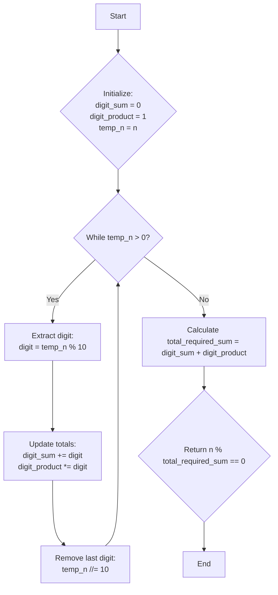

# [3622] Check Divisibility by Digit Sum and Product

**Difficulty:** Easy &nbsp;·&nbsp; **Daily Challenge:** 2026-08-22 &nbsp;·&nbsp; [Open on LeetCode](https://leetcode.com/problems/check-divisibility-by-digit-sum-and-product/)

**Topics:** Math

> 🧠 Auto-generated study note. Read it, understand it, then **paste the solution yourself** on LeetCode. Nothing here is auto-submitted.

---

## Original Problem

You are given a positive integer n. Determine whether n is divisible by the sum of the following two values:

-
	The digit sum of n (the sum of its digits).

-
	The digit product of n (the product of its digits).

Return true if n is divisible by this sum; otherwise, return false.

Example 1:

Input: n = 99

Output: true

Explanation:

Since 99 is divisible by the sum (9 + 9 = 18) plus product (9 * 9 = 81) of its digits (total 99), the output is true.

Example 2:

Input: n = 23

Output: false

Explanation:

Since 23 is not divisible by the sum (2 + 3 = 5) plus product (2 * 3 = 6) of its digits (total 11), the output is false.

Constraints:

- 1 <= n <= 10^6

**Examples / sample tests:**

```
99
23
```

---

## Problem Summary
Given a positive integer `n`, we need to determine if `n` is perfectly divisible by a specific sum. This sum is calculated by adding two values: the sum of `n`'s digits and the product of `n`'s digits.

## Intuition
The core of this problem is **digit extraction**. To find the sum and product of digits, we need a systematic way to get each digit from the number `n`.
The standard trick for this is to repeatedly use the modulo operator (`%`) and integer division (`//`):
1.  `number % 10` gives you the **last digit** of `number`.
2.  `number // 10` effectively **removes the last digit** from `number`.
By repeating these two operations in a loop until `number` becomes 0, we can process every digit. We'll maintain two running totals: one for the sum of digits and one for the product of digits.

## Approach
The optimal approach involves a single pass to extract digits and compute their sum and product.

1.  **Initialize variables**:
    *   Create a variable `digit_sum` and initialize it to `0`. This will store the sum of all digits.
    *   Create a variable `digit_product` and initialize it to `1`. This will store the product of all digits. (Initialize to 1, not 0, because multiplying by 0 would make the product always 0 unless we handle it specially).
    *   Create a temporary variable, say `temp_n`, and assign it the value of the input `n`. We'll modify `temp_n` to extract digits, preserving the original `n` for the final divisibility check.

2.  **Extract digits in a loop**:
    *   Start a `while` loop that continues as long as `temp_n` is greater than `0`.
    *   Inside the loop:
        *   Get the **last digit**: `digit = temp_n % 10`.
        *   Add this `digit` to `digit_sum`: `digit_sum += digit`.
        *   Multiply this `digit` into `digit_product`: `digit_product *= digit`.
        *   Remove the last digit from `temp_n`: `temp_n //= 10`.

3.  **Calculate the final sum**:
    *   After the loop finishes (meaning all digits have been processed), calculate `total_required_sum = digit_sum + digit_product`.

4.  **Check divisibility**:
    *   Return `True` if `n % total_required_sum == 0`.
    *   Otherwise, return `False`.
    *   **Important Note**: `total_required_sum` will always be at least 1 (since `n >= 1`, `digit_sum` will be at least 1, even if `digit_product` becomes 0 due to a digit '0'). So, division by zero is not a concern.

## Visualization


## Dry Run
Let's trace `n = 99` (Example 1).

| Step | `n` | `temp_n` (start) | `digit` | `digit_sum` | `digit_product` | `temp_n` (end) | Notes |
| :--- | :-: | :--------------: | :-----: | :-----------: | :-------------: | :-------------: | :---- |
| Initial | 99 | 99 | - | 0 | 1 | 99 | `n` is stored, `temp_n` is copy. |
| Loop 1 | 99 | 99 | 9 | 9 | 9 | 9 | `digit = 99 % 10 = 9`. `sum = 0+9=9`. `prod = 1*9=9`. `temp_n = 99 // 10 = 9`. |
| Loop 2 | 99 | 9 | 9 | 18 | 81 | 0 | `digit = 9 % 10 = 9`. `sum = 9+9=18`. `prod = 9*9=81`. `temp_n = 9 // 10 = 0`. |
| After Loop | 99 | 0 | - | 18 | 81 | 0 | `temp_n` is 0, loop terminates. |
| Final Calc | 99 | - | - | - | - | - | `total_required_sum = digit_sum + digit_product = 18 + 81 = 99`. |
| Result | 99 | - | - | - | - | - | Check `n % total_required_sum == 0`: `99 % 99 == 0`. This is `True`. |

The final result is `True`.

## Complexity
*   **Time Complexity**: O(log N). We iterate once for each digit in `n`. The number of digits in `n` is proportional to `log10(n)`. Since `n` is at most `10^6` (7 digits), this is a very fast operation.
*   **Space Complexity**: O(1). We only use a few constant extra variables (`digit_sum`, `digit_product`, `temp_n`, `digit`, `total_required_sum`), regardless of the size of `n`.

## Edge Cases
*   **Single-digit numbers (e.g., `n = 7`)**:
    *   `digit_sum = 7`, `digit_product = 7`.
    *   `total_required_sum = 7 + 7 = 14`.
    *   `7 % 14 != 0`. Returns `False`. Correct.
*   **Numbers containing zero (e.g., `n = 10`)**:
    *   `temp_n = 10`: `digit = 0`, `digit_sum = 0`, `digit_product = 0`. `temp_n = 1`.
    *   `temp_n = 1`: `digit = 1`, `digit_sum = 1`, `digit_product = 0`. `temp_n = 0`.
    *   `total_required_sum = 1 + 0 = 1`.
    *   `10 % 1 == 0`. Returns `True`. Correct. This confirms `digit_product` correctly becomes 0 if any digit is 0, and `total_required_sum` remains valid (not zero).
*   **Smallest `n` (`n = 1`)**:
    *   `digit_sum = 1`, `digit_product = 1`.
    *   `total_required_sum = 1 + 1 = 2`.
    *   `1 % 2 != 0`. Returns `False`. Correct.

## Solution
```python
class Solution:
    def checkDivisibility(self, n: int) -> bool:
        # Store the original n for the final divisibility check
        original_n = n 
        
        # Initialize variables to store the sum and product of digits
        digit_sum = 0
        digit_product = 1 # Initialize to 1 so multiplication works correctly

        # Use a temporary variable to extract digits without modifying original_n
        temp_n = n

        # Loop to extract each digit
        while temp_n > 0:
            # Get the last digit
            digit = temp_n % 10
            
            # Add the digit to the sum
            digit_sum += digit
            
            # Multiply the digit into the product
            digit_product *= digit
            
            # Remove the last digit from temp_n
            temp_n //= 10
        
        # Calculate the total sum required for divisibility check
        total_required_sum = digit_sum + digit_product
        
        # Check if original_n is divisible by total_required_sum
        # total_required_sum will always be >= 1 because n >= 1, so digit_sum >= 1.
        return original_n % total_required_sum == 0

```

## Why This Works
This solution works because the digit extraction method (`% 10` and `// 10`) is a standard and correct way to process each digit of an integer. By initializing `digit_sum` to 0 and `digit_product` to 1, we ensure that the running totals are correctly accumulated. The loop guarantees that every digit is processed exactly once. Finally, the modulo operator (`%`) correctly determines if `n` is perfectly divisible by the calculated `total_required_sum`. The constraints on `n` (positive integer, up to `10^6`) ensure that `total_required_sum` will always be positive, preventing division by zero errors.

---
<sub>Generated 2026-08-22 02:00 UTC by the Daily LeetCode Explainer (Gemini) • language: Python • not submitted automatically.</sub>
