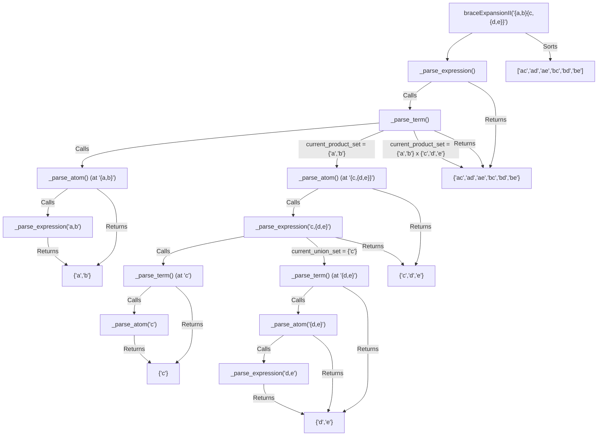

# [1096] Brace Expansion II

**Difficulty:** Hard &nbsp;·&nbsp; **Daily Challenge:** 2026-09-25 &nbsp;·&nbsp; [Open on LeetCode](https://leetcode.com/problems/brace-expansion-ii/)

**Topics:** Hash Table, String, Backtracking, Stack, Breadth-First Search, Sorting

> 🧠 Auto-generated study note. Read it, understand it, then **paste the solution yourself** on LeetCode. Nothing here is auto-submitted.

---

## Original Problem

Under the grammar given below, strings can represent a set of lowercase words. Let R(expr) denote the set of words the expression represents.

The grammar can best be understood through simple examples:

- Single letters represent a singleton set containing that word.

- R("a") = {"a"}

- R("w") = {"w"}

- When we take a comma-delimited list of two or more expressions, we take the union of possibilities.

- R("{a,b,c}") = {"a","b","c"}

- R("{{a,b},{b,c}}") = {"a","b","c"} (notice the final set only contains each word at most once)

- When we concatenate two expressions, we take the set of possible concatenations between two words where the first word comes from the first expression and the second word comes from the second expression.

- R("{a,b}{c,d}") = {"ac","ad","bc","bd"}

- R("a{b,c}{d,e}f{g,h}") = {"abdfg", "abdfh", "abefg", "abefh", "acdfg", "acdfh", "acefg", "acefh"}

Formally, the three rules for our grammar:

- For every lowercase letter x, we have R(x) = {x}.

- For expressions e_1, e_2, ... , e_k with k >= 2, we have R({e_1, e_2, ...}) = R(e_1) ∪ R(e_2) ∪ ...

- For expressions e_1 and e_2, we have R(e_1 + e_2) = {a + b for (a, b) in R(e_1) × R(e_2)}, where + denotes concatenation, and × denotes the cartesian product.

Given an expression representing a set of words under the given grammar, return the sorted list of words that the expression represents.

Example 1:

Input: expression = "{a,b}{c,{d,e}}"
Output: ["ac","ad","ae","bc","bd","be"]

Example 2:

Input: expression = "{{a,z},a{b,c},{ab,z}}"
Output: ["a","ab","ac","z"]
Explanation: Each distinct word is written only once in the final answer.

Constraints:

- 1 <= expression.length <= 60

- expression[i] consists of '{', '}', ','or lowercase English letters.

- The given expression represents a set of words based on the grammar given in the description.

**Examples / sample tests:**

```
"{a,b}{c,{d,e}}"
"{{a,z},a{b,c},{ab,z}}"
```

---

## Problem Summary
This problem asks us to evaluate a string expression that represents a set of words. The grammar defines three rules: single letters form singleton sets, comma-separated expressions within curly braces form a union of sets, and adjacent expressions form a Cartesian product (concatenation) of words from their respective sets. The final output should be a sorted list of all unique words represented by the expression.

## Intuition
The problem involves parsing a string with nested structures (like parentheses in arithmetic expressions) and applying set operations (union and Cartesian product). This immediately suggests a **recursive descent parser** approach. We can define functions that correspond to the grammar rules: one for handling unions (comma-separated lists), one for handling concatenations, and one for the basic "atoms" (single letters or grouped expressions). The key is to manage the current parsing position in the string and recursively call these functions to evaluate sub-expressions.

## Approach
We'll implement a recursive descent parser with three mutually recursive helper methods:

1.  **`_parse_expression()`**: This function handles **union** operations. It processes a sequence of "terms" separated by commas.
    *   It initializes an empty `set` to accumulate words.
    *   It repeatedly calls `_parse_term()` to get the set of words for the current term.
    *   It adds all words from the `_parse_term()` result to its accumulating set (performing a set union).
    *   If it encounters a comma (`,`), it skips it and continues to parse the next term.
    *   If it encounters a closing brace (`}`) or the end of the string, it stops and returns the accumulated set.

2.  **`_parse_term()`**: This function handles **concatenation** operations. It processes a sequence of "atoms" placed next to each other.
    *   It initializes a `set` containing an **empty string `""`**. This is crucial because concatenating any word with an empty string results in the original word, correctly starting the product.
    *   It repeatedly calls `_parse_atom()` to get the set of words for the current atom.
    *   It then performs a **Cartesian product** (concatenation) between its current accumulated set of words and the set returned by `_parse_atom()`. For every word `w1` in the accumulated set and every word `w2` in the atom's set, it adds `w1 + w2` to a new accumulating set.
    *   It continues this process as long as the next character can start a new atom (a letter or an opening brace `{`).

3.  **`_parse_atom()`**: This function handles the **base cases** or smallest units of the grammar.
    *   If the current character is a **lowercase letter**, it forms a singleton set containing that letter and returns it.
    *   If the current character is an **opening brace (`{`)**, it skips the brace, recursively calls `_parse_expression()` to evaluate the content inside, and then skips the corresponding closing brace (`}`). It returns the set obtained from the inner expression.

The main `braceExpansionII` method initializes a global index `self.i` to track the current position in the input `expression` string and then calls `_parse_expression()` to start the parsing. Finally, it converts the resulting set of words into a sorted list.

## Visualization
Let's visualize the recursive calls and their return values for `expression = "{a,b}{c,{d,e}}"`. The `self.i` pointer moves forward as characters are consumed.



## Dry Run
Let's trace `expression = "{a,b}{c,{d,e}}"`:

| Step | `self.i` | Call Stack | Current `expression_str[self.i]` | Action / Return Value |
| :--- | :------- | :--------- | :------------------------------- | :-------------------- |
| 1    | 0        | `braceExpansionII` | `{`                              | Calls `_parse_expression()` |
| 2    | 0        | `_parse_expression` | `{`                              | `current_union_set = {}`. Calls `_parse_term()` |
| 3    | 0        | `_parse_term` | `{`                              | `current_product_set = {""}`. Calls `_parse_atom()` |
| 4    | 0        | `_parse_atom` | `{`                              | Skips `{` (`self.i=1`). Calls `_parse_expression()` |
| 5    | 1        | `_parse_expression` | `a`                              | `current_union_set = {}`. Calls `_parse_term()` |
| 6    | 1        | `_parse_term` | `a`                              | `current_product_set = {""}`. Calls `_parse_atom()` |
| 7    | 1        | `_parse_atom` | `a`                              | Returns `{"a"}` (`self.i=2`) |
| 8    | 2        | `_parse_term` | `,`                              | `current_product_set = {""} x {"a"} = {"a"}`. Loop ends. Returns `{"a"}` |
| 9    | 2        | `_parse_expression` | `,`                              | `current_union_set = {"a"}`. Skips `,` (`self.i=3`). Calls `_parse_term()` |
| 10   | 3        | `_parse_term` | `b`                              | `current_product_set = {""}`. Calls `_parse_atom()` |
| 11   | 3        | `_parse_atom` | `b`                              | Returns `{"b"}` (`self.i=4`) |
| 12   | 4        | `_parse_term` | `}`                              | `current_product_set = {""} x {"b"} = {"b"}`. Loop ends. Returns `{"b"}` |
| 13   | 4        | `_parse_expression` | `}`                              | `current_union_set = {"a", "b"}`. Loop ends. Returns `{"a", "b"}` |
| 14   | 4        | `_parse_atom` | `}`                              | Skips `}` (`self.i=5`). Returns `{"a", "b"}` |
| 15   | 5        | `_parse_term` | `{`                              | `current_product_set = {"a", "b"} x {"a", "b"}` (from step 8 and 14) = `{"a", "b"}`. Calls `_parse_atom()` |
| 16   | 5        | `_parse_atom` | `{`                              | Skips `{` (`self.i=6`). Calls `_parse_expression()` |
| 17   | 6        | `_parse_expression` | `c`                              | `current_union_set = {}`. Calls `_parse_term()` |
| 18   | 6        | `_parse_term` | `c`                              | `current_product_set = {""}`. Calls `_parse_atom()` |
| 19   | 6        | `_parse_atom` | `c`                              | Returns `{"c"}` (`self.i=7`) |
| 20   | 7        | `_parse_term` | `,`                              | `current_product_set = {"c"}`. Loop ends. Returns `{"c"}` |
| 21   | 7        | `_parse_expression` | `,`                              | `current_union_set = {"c"}`. Skips `,` (`self.i=8`). Calls `_parse_term()` |
| 22   | 8        | `_parse_term` | `{`                              | `current_product_set = {""}`. Calls `_parse_atom()` |
| 23   | 8        | `_parse_atom` | `{`                              | Skips `{` (`self.i=9`). Calls `_parse_expression()` |
| 24   | 9        | `_parse_expression` | `d`                              | `current_union_set = {}`. Calls `_parse_term()` |
| 25   | 9        | `_parse_term` | `d`                              | `current_product_set = {""}`. Calls `_parse_atom()` |
| 26   | 9        | `_parse_atom` | `d`                              | Returns `{"d"}` (`self.i=10`) |
| 27   | 10       | `_parse_term` | `,`                              | `current_product_set = {"d"}`. Loop ends. Returns `{"d"}` |
| 28   | 10       | `_parse_expression` | `,`                              | `current_union_set = {"d"}`. Skips `,` (`self.i=11`). Calls `_parse_term()` |
| 29   | 11       | `_parse_term` | `e`                              | `current_product_set = {""}`. Calls `_parse_atom()` |
| 30   | 11       | `_parse_atom` | `e`                              | Returns `{"e"}` (`self.i=12`) |
| 31   | 12       | `_parse_term` | `}`                              | `current_product_set = {"e"}`. Loop ends. Returns `{"e"}` |
| 32   | 12       | `_parse_expression` | `}`                              | `current_union_set = {"d", "e"}`. Loop ends. Returns `{"d", "e"}` |
| 33   | 12       | `_parse_atom` | `}`                              | Skips `}` (`self.i=13`). Returns `{"d", "e"}` |
| 34   | 13       | `_parse_term` | `}`                              | `current_product_set = {""} x {"d", "e"} = {"d", "e"}`. Loop ends. Returns `{"d", "e"}` |
| 35   | 13       | `_parse_expression` | `}`                              | `current_union_set = {"c", "d", "e"}`. Loop ends. Returns `{"c", "d", "e"}` |
| 36   | 13       | `_parse_atom` | `}`                              | Skips `}` (`self.i=14`). Returns `{"c", "d", "e"}` |
| 37   | 14       | `_parse_term` | (End)                            | `current_product_set = {"a", "b"} x {"c", "d", "e"} = {"ac", "ad", "ae", "bc", "bd", "be"}`. Loop ends. Returns `{"ac", "ad", "ae", "bc", "bd", "be"}` |
| 38   | 14       | `_parse_expression` | (End)                            | `current_union_set = {"ac", "ad", "ae", "bc", "bd", "be"}`. Loop ends. Returns `{"ac", "ad", "ae", "bc", "bd", "be"}` |
| 39   | 14       | `braceExpansionII` | (End)                            | Receives `{"ac", "ad", "ae", "bc", "bd", "be"}`. Sorts and returns. |

**Final Result:** `["ac", "ad", "ae", "bc", "bd", "be"]`

## Complexity
*   **Time Complexity**: Let `N` be the length of the input `expression`. The number of recursive calls is proportional to `N`. In each call, the most expensive operation is the Cartesian product in `_parse_term()`. If `W` is the maximum number of words in any intermediate set and `L` is the maximum length of a word, then a Cartesian product takes `O(W_1 * W_2 * L)` time. Since `W` can grow, and there are `O(N)` such operations, the worst-case time complexity is roughly `O(N * W_max^2 * L_max)`. Given `N <= 60`, `L_max <= 60`, `W_max` must be implicitly bounded by the test cases to allow this solution to pass within typical time limits (e.g., `W_max` around 100-200).
*   **Space Complexity**: The maximum recursion depth is `O(N)`. Each recursive call stores a set of words. In the worst case, we might store `O(N)` such sets on the call stack. Each set can contain up to `W_max` words, each of length up to `L_max`. Thus, the space complexity is `O(N * W_max * L_max)`. With `N=60`, `W_max=200`, `L_max=60`, this is `60 * 200 * 60 = 720,000` characters, which is well within memory limits.

## Edge Cases
*   **Single letter expression**: `expression = "a"`. The parser correctly identifies 'a' as an atom, returns `{"a"}`, and the final result is `["a"]`.
*   **Simple union**: `expression = "{a,b}"`. `_parse_expression` correctly unions `{"a"}` and `{"b"}` to return `{"a", "b"}`.
*   **Simple concatenation**: `expression = "ab"`. `_parse_term` correctly concatenates `{"a"}` and `{"b"}` to return `{"ab"}`.
*   **Nested unions/concatenations**: The recursive structure inherently handles arbitrary nesting as shown in the dry run and visualization.
*   **Duplicate words**: `expression = "{{a,z},a{b,c},{ab,z}}"`. The use of `set` for `current_union_set` and `current_product_set` automatically handles uniqueness, ensuring each distinct word appears only once in the final result.

## Solution

```python
class Solution:
    def braceExpansionII(self, expression: str) -> list[str]:
        self.expression_str = expression
        self.i = 0  # Global index to track current position in the expression string

        # Start the parsing process by evaluating the top-level expression
        result_set = self._parse_expression()

        # Convert the final set of unique words to a list and sort it
        return sorted(list(result_set))

    def _parse_expression(self) -> set[str]:
        """
        Parses a comma-delimited list of terms, representing a union.
        Example: "a,b,c" or "{a,b},{c,d}"
        """
        current_union_set = set()

        # Continue parsing terms as long as we are within bounds and haven't hit a closing brace
        while self.i < len(self.expression_str):
            # Parse a single term (which might be a concatenation of atoms)
            term_result = self._parse_term()
            current_union_set.update(term_result) # Perform union operation

            # If the next character is a comma, skip it and continue parsing for more terms
            if self.i < len(self.expression_str) and self.expression_str[self.i] == ',':
                self.i += 1
            # If it's a closing brace or end of string, this expression is complete
            else:
                break
        
        return current_union_set

    def _parse_term(self) -> set[str]:
        """
        Parses a sequence of atoms concatenated together.
        Example: "ab", "a{b,c}", "{a,b}c"
        """
        # Initialize with a set containing an empty string. This is crucial for the first
        # concatenation, as "" + "word" = "word".
        current_product_set = {""} 

        # Loop as long as we see characters that can start an atom:
        # a lowercase letter or an opening brace '{'
        while self.i < len(self.expression_str) and \
              (self.expression_str[self.i].isalpha() or self.expression_str[self.i] == '{'):
            
            # Parse the next atomic unit
            atom_result = self._parse_atom()
            
            # Perform Cartesian product (concatenation) between current_product_set and atom_result
            new_product_set = set()
            for word1 in current_product_set:
                for word2 in atom_result:
                    new_product_set.add(word1 + word2)
            
            current_product_set = new_product_set
        
        return current_product_set

    def _parse_atom(self) -> set[str]:
        """
        Parses the smallest unit: a single letter or a grouped expression enclosed in braces.
        Example: "a", "{a,b}"
        """
        char = self.expression_str[self.i]

        if char.isalpha():
            # If it's a letter, form a singleton set
            self.i += 1 # Move past the letter
            return {char}
        elif char == '{':
            # If it's an opening brace, parse the inner expression recursively
            self.i += 1 # Move past '{'
            inner_set = self._parse_expression() # Recursive call to handle content inside braces
            
            # After parsing the inner expression, we expect a closing brace.
            # The problem guarantees valid input, so we just skip it.
            self.i += 1 # Move past '}'
            return inner_set
        else:
            # This case should ideally not be reached given the problem constraints
            # (valid input, only specified characters).
            raise ValueError(f"Unexpected character: {char} at index {self.i}")

```

## Why This Works
This solution works because it correctly implements a **recursive descent parser** for the given grammar. The grammar is context-free and can be parsed top-down. Each parsing function (`_parse_expression`, `_parse_term`, `_parse_atom`) is responsible for a specific part of the grammar, consuming characters from the input string and recursively calling other parsing functions for sub-expressions. The use of a global index `self.i` ensures that each character is processed exactly once by the current level of parsing. The `set` data structure automatically handles the requirement for unique words, and the Cartesian product logic correctly implements concatenation. The base case of `_parse_term` starting with `{" "}` ensures that initial concatenations are handled correctly. The problem's constraint on expression length (`N <= 60`) implies that the number of intermediate words generated (`W_max`) and their lengths (`L_max`) remain within practical limits for this approach to complete in time.

---
<sub>Generated 2026-09-25 05:18 UTC by the Daily LeetCode Explainer (Gemini) • language: Python • not submitted automatically.</sub>
